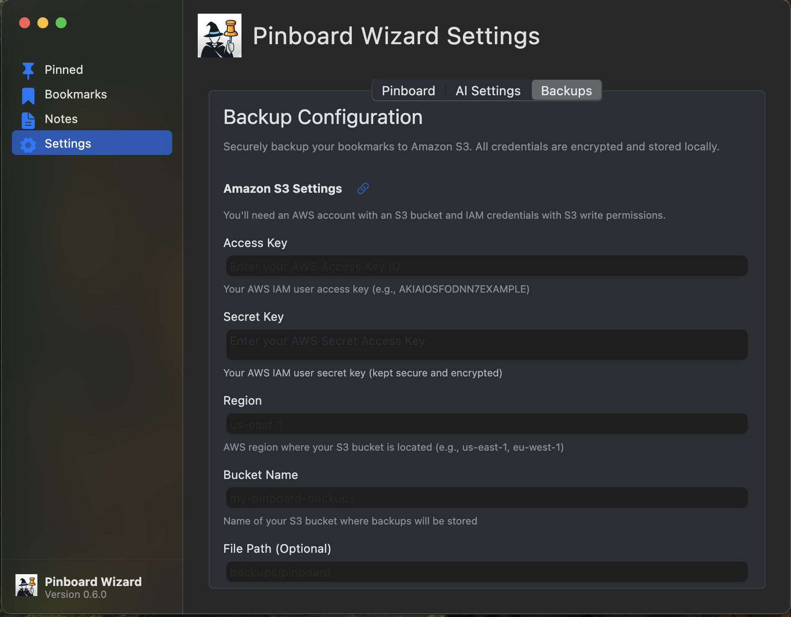

# Pinboard Wizard

A powerful, native macOS client for [Pinboard.in](https://pinboard.in) built with Flutter. Designed for power users who want curated bookmark collections, AI-enhanced management, and secure cloud backups.

## Screenshots

### Bookmarks Management


### Pin-Based Curation System


### Notes Organization


## Installation

### Homebrew (Recommended)

Install Pinboard Wizard using Homebrew:

```bash
brew tap rikuvan/formulae
brew install --cask rikuvan/formulae/pinboard-wizard
```

## Setup

After installation, you'll need to configure Pinboard Wizard with your API credentials:

1. Launch Pinboard Wizard
2. On first run, you'll be prompted to enter your Pinboard API token
3. Get your API token from: https://pinboard.in/settings/password
4. Copy and paste the token into the app

For additional configuration options and services integration, visit: https://pinboard.in/api/

The app will sync your bookmarks and be ready to use once the API token is configured.

## Homebrew Management

Check installed version:

```bash
# Check version via Homebrew
brew list --cask --versions rikuvan/formulae/pinboard-wizard

# Or check cask info (shows installed + latest available)
brew info --cask rikuvan/formulae/pinboard-wizard
```

Upgrade to latest version:

```bash
brew upgrade --cask rikuvan/formulae/pinboard-wizard
```

Uninstall Pinboard Wizard:

```bash
# Regular uninstall - removes only the main app
brew uninstall --cask rikuvan/formulae/pinboard-wizard

# Zap - removes app + ALL associated data/settings
brew uninstall --zap --cask rikuvan/formulae/pinboard-wizard
```

**Use `--zap` for complete removal** including preferences, caches, and all configuration files - useful for troubleshooting or clean reinstalls.

### Manual Download

Download the latest release from the [releases page](https://github.com/RikuVan/pinboard_wizard/releases).

## What Sets This Apart

**Pinboard Wizard isn't just another bookmark manager.** It's designed for users who:

### 🎯 **Want Curated Bookmark Collections**

Traditional bookmark managers treat all bookmarks equally. We hack Pinboard's tagging system to create a **pin-based curation system**:

- **Pin with categories**: find your most important bookmarks by pinning them, optionally under a category like `pin:work`, `pin:reading`, `pin:tools`

### 🤖 **Want Smart Content Extraction**

Multiple content extraction options to fit your needs:

- **Free extraction**: Built-in Pina service (add API key, no account needed) extracts titles, descriptions, and content
- **AI enhancement**: Optional OpenAI integration for intelligent tagging and summaries (bring your own key, ~$0.50-2/month)
- **No vendor lock-in**: Your data stays in Pinboard, all enhancements are optional

### ☁️ **Want Secure Cloud Backup Options**

Your bookmarks are precious. Keep them safe with AWS S3 integration:

- **Direct S3 backup**: Export to your own AWS bucket
- **Full control**: You own your data and backup location
- **Disaster recovery**: Import from S3 if needed

---

**Perfect for**: Developers and power users.

## Features

#### How Pin Categories Work

The pin categorization system transforms Pinboard's simple tagging into a powerful curation tool:

**Basic Pinning:**

- Tag with `pin` → Appears in "General" section
- Simple one-click pinning from bookmark list

**Categorized Pinning:**

- Tag with `pin:work` → Creates "Work" category
- Tag with `pin:work-projects` → Creates "Work Projects" category
- Tag with `pin:reading-list` → Creates "Reading List" category

**Smart Features:**

- **Dynamic categories**: Categories appear automatically as you create them
- **Existing category suggestions**: Reuse categories with one click
- **Intelligent formatting**: Hyphens become spaces, proper capitalization
- **Grouped display**: Pinned page shows bookmarks organized by category
- **Easy management**: Update categories or remove pins entirely

### 🤖 **Content Extraction & AI**

- **Pina integration**: Free content extraction (API key required, no account needed)
- **OpenAI integration**: Optional AI tagging and summaries (bring your own key, ~$0.50-2/month)
- **Smart metadata**: Auto-generate titles, descriptions, and tags from URLs

### ⌨️ **Keyboard Shortcuts**

- **⌘+B** - Add new bookmark
- **⌘+1-4** - Navigate between sections (Pinned, Bookmarks, Notes, Settings)
- **⌘+R** - Refresh current page

### 📱 **Native macOS Experience**

- Built with macOS UI components and design patterns
- Menu bar integration with keyboard shortcut indicators
- Native dialogs and sheets
- System-appropriate light/dark mode support
- Proper focus management and accessibility

### 🔐 **Secure & Private**

- Your API credentials are stored securely in the macOS Keychain
- All communication with Pinboard uses HTTPS
- No data is stored on third-party servers

### ☁️ **AWS S3 Backup Integration**

- **Direct S3 backup**: Export bookmarks to your own AWS bucket
- **Scheduled exports**: Automated backup workflows
- **Disaster recovery**: Import from S3 backups if needed
- **Full data control**: You own your backup location and access
- **JSON format**: Standard format for maximum compatibility

## First-Time Setup

1. Launch Pinboard Wizard
2. Navigate to **Settings** (⌘+4)
3. Enter your Pinboard API token (get it from [https://pinboard.in/settings/password](https://pinboard.in/settings/password))
4. Test the connection
5. Start browsing your bookmarks!


### Optional: Enhanced Content Extraction

**Pina Setup (Free):**

1. Go to **Settings** → **Content Extraction**
2. Add your Pina API key (no account required)
3. Enable automatic content extraction for new bookmarks

**AI Features Setup (Optional):**

1. Get your OpenAI API key from [https://platform.openai.com/api-keys](https://platform.openai.com/api-keys)
2. Go to **Settings** → **AI Settings**
3. Enter your OpenAI API key
4. Configure preferred model (GPT-3.5-turbo recommended)


**Cost estimate**: AI features typically €0-3/month for moderate usage

## Development

### Prerequisites

- macOS 15.0+ (Sequoia or later)
- [Flutter](https://flutter.dev/docs/get-started/install) 3.0+ installed
- Xcode Command Line Tools
- A [Pinboard.in](https://pinboard.in) account with API token

### Quick Start

1. **Clone the repository:**

   ```bash
   git clone https://github.com/yourusername/pinboard_wizard.git
   cd pinboard_wizard
   ```

2. **Install dependencies:**

   ```bash
   make doctor  # Check Flutter installation
   flutter pub get
   ```

3. **Run the app:**
   ```bash
   make run
   ```

### Available Make Commands

| Command        | Description                |
| -------------- | -------------------------- |
| `make run`     | Run app in debug mode      |
| `make build`   | Build macOS app bundle     |
| `make test`    | Run unit/widget tests      |
| `make analyze` | Run code analysis          |
| `make format`  | Format all Dart files      |
| `make clean`   | Clean build artifacts      |
| `make doctor`  | Check Flutter installation |

### Project Structure

```
lib/src/
├── common/           # Shared utilities and components
│   ├── widgets/      # Reusable UI components
│   ├── state/        # State management
│   └── extensions/   # Extension methods
├── pages/            # Main app screens
│   ├── bookmarks/    # Bookmark management
│   ├── pinned/       # Pinned bookmarks
│   ├── notes/        # Notes functionality
│   └── settings/     # App configuration
├── pinboard/         # Pinboard API integration
├── ai/               # AI service integration
├── auth/             # Authentication flow
└── backup/           # Backup/export functionality
```

### Key Technologies

- **Flutter** - Cross-platform UI framework
- **macos_ui** - Native macOS UI components
- **flutter_bloc** - State management with Cubit pattern
- **flutter_secure_storage** - Secure credential storage
- **get_it** - Dependency injection
- **http** - API communication

### Contributing

1. Fork the repository
2. Create a feature branch (`git checkout -b feature/amazing-feature`)
3. Make your changes
4. Run tests (`make test`)
5. Format code (`make format`)
6. Commit your changes (`git commit -m 'Add amazing feature'`)
7. Push to the branch (`git push origin feature/amazing-feature`)
8. Open a Pull Request

### Running Tests

```bash
# Run all tests
make test

# Run with coverage
flutter test --coverage

# Run analyzer
make analyze
```

## Configuration

### Environment Variables

The app supports the following optional environment variables:

- `OPENAI_API_KEY` - Default OpenAI API key for AI features (you provide your own)
- `DEBUG_MODE` - Enable debug logging

### Settings File

User settings are stored in the macOS app container. The app handles:

- Pinboard API credentials (in Keychain)
- Your OpenAI API key (in Keychain, never shared)
- AI service configuration and usage tracking
- UI preferences
- AWS S3 backup settings



## Troubleshooting

### Common Issues

**"Could not connect to Pinboard"**

- Check your internet connection
- Verify your API token is correct
- Ensure Pinboard.in is accessible

**"AI features not working"**

- Verify your OpenAI API key is valid and has sufficient credits
- Check your OpenAI account billing status at [https://platform.openai.com/usage](https://platform.openai.com/usage)
- Monitor your costs: AI analysis typically uses $0.01-0.05 per bookmark
- Try disabling and re-enabling AI features

**"App won't start"**

- Run `make doctor` to check Flutter setup
- Try `make clean` followed by `make run`
- Check macOS version compatibility

## License

This project is licensed under the MIT License - see the [LICENSE](LICENSE) file for details.

## Acknowledgments

- [Pinboard.in](https://pinboard.in) - The excellent bookmarking service
- [Flutter](https://flutter.dev) - The UI framework
- [macos_ui](https://pub.dev/packages/macos_ui) - Native macOS UI components
- The Flutter community for amazing packages and support

---

**Made with ❤️ for Pinboard enthusiasts**
